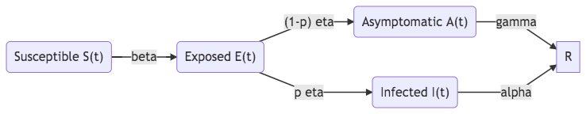
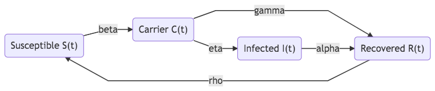
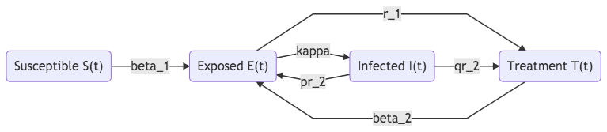
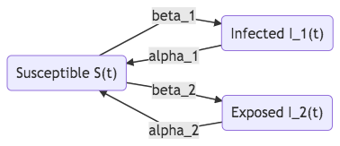

.. role:: highlit

Classical Models in Epidemics
==================================

The classical models in epidemics are compartment models. In such models, the hosts are arranged into different populations such as susceptible populations, infected populations, and recovered populations.

SIR
-------------------

   SIR model

The Kermack-McKendrick deterministic model describes the transitions between the different populations. The susceptible population :math:`S(t)` decrease at a rate :math:`-\alpha I(t) S(t)`, where :math:`\beta` is the average probability of getting infected by the infected population. The recovery rate of the infected population is :math:`\alpha`.

.. math::
   \frac{dS(t)}{dt} &= -\beta I(t) S(t) \\
   \frac{dI(t)}{dt} &= \beta S(t) I(t) - \alpha I(t),
   :label: eqn-kermack-mckendrick-eqn-n

with the constraint

.. math::
   S(t) + I(t) + R(t) = N,

where :math:`N` is the total population. [Martcheva2015]_

The limiting behavior of the system is also intuitive. If the infected population is quarantined, i.e., :math:`\beta=0`, the infected population decays exponentially with a half-life :math:`1/\alpha`. Notice that the populations can only be integers. When :math:`S(t)<1`, the infected population moves to the exponential decay phase.

At a specific time :math:`t=t_t`, we might reach the threshold that

.. math::
   \beta S(t_t) - \alpha = 0.

Suppose the susceptible population is larger initially, we would have :math:`\beta S(t_0) - \alpha > 0` initially. The infected population will grow. The threshold indicates a flipping moment when the infected population will start to decrease.

The threshold requires

.. math::
   \frac{\beta S(t_t)}{\alpha} = 1.

When :math:`\frac{\beta S(t_t)}{\alpha}>1`, the infected population is growing. It is convinient to define

.. math::
   \tau(t) = \frac{\beta S(t)}{\alpha},

with which equations :eq:`eqn-kermack-mckendrick-eqn-n` becomes

.. math::
   \frac{dS(t)}{dt} &= - \alpha \tau(t) I(t)  \\
   \frac{dI(t)}{dt} &= \alpha (\tau(t) - 1) I(t),

If :math:`\tau(t)>1`, the infected population will grow. If :math:`\tau(t)<1`, the infected population will decrease.

In the **very beginning of a epidemic event**, the susceptible population fraction is almost constant, thus :math:`\tau(t)` is almost constant, i.e., :math:`\tau(t) = \tau_0`, the growth rate of :math:`I(t)` is

.. math::
   \frac{dI(t)}{dt} = \alpha (\tau_0 - 1) I(t).

The equations are solved

.. math::
   I(t) = I(t_0) e^{\alpha (\tau_0 - 1) t}.

The exponential growth rate is determined by

.. math::
   \alpha (\tau_0 - 1).

The days :math:`\Delta t` required to double the infected population is a constant in the early stage. To find out :math:`\Delta t_d`,

.. math::
   \frac{I(t+\Delta t)}{I(t)} = e^{\alpha (\tau_0 - 1) \Delta t} \equiv 2,

which leads to

.. math::
   \Delta t = \frac{\ln 2}{\alpha(\tau_0 -1)} \sim \frac{0.7}{\alpha(\tau_0 -1)} .

Simulate SIR Using Poisson Process
~~~~~~~~~~~~~~~~~~~~~~~~~~~~~~~~~~~~~

The transition events of a susceptible person being infected (:math:`S\to I`) and an infected person being recovered (:math:`I\to R`).

The rates are determined by the equation :eq:`eqn-kermack-mckendrick-eqn-n`,

.. math::
   Y_{S\to I}\left(\int_0^t \beta I(t') S(t') dt' \right)

and

.. math::
   Y_{I\to R}\left( \int_0^t \alpha I(t') dt' \right).

Whenever an event is triggered in the process :math:`Y_{S\to I}`, we will have one more infected person and one less susceptible person.

In fact, :math:`1/\alpha` is the mean days an infected person remains in the infectd status. This is used to estimate the :math:`\alpha` using data. The value of :math:`\beta` is estimated using the relation [Martcheva2015]_

.. math::
   \frac{\beta}{\alpha} = \frac{\ln (S(t_0)/S(t\to\infty))}{S(t_0) + I(t_0) - S(t\to\infty) }

SIS
-------------------

Some epidemics such as influenza infect us repeatedly. One simple model for them is the SIS model shown in figure :ref:`epidemic-compartment-sis-scheme`,

.. _epidemic-compartment-sis-scheme:

   SIS model.

The dynamics are determined by

.. math::
   \frac{dI(t)}{dt} = \beta I(t) S(t) - \alpha I(t),

with the constraint

.. math::
   S(t) + I(t) = N.

The dynamics of the basic SIS model is determined by one single first-order differential equation

.. math::
   \frac{dI(t)}{dt} &= \beta I(t) (N - I(t)) - \alpha I(t) \\
   &= (\beta N - \alpha )I(t) - \beta I(t) I(t) \\
   &= (\beta N - \alpha )I(t) \left( 1 - \frac{I(t)}{(\beta N - \alpha)/\beta} \right) \\
   &\equiv r \left(1 - \frac{I}{r/\beta}\right) I(t),

where we defined the :highlit:`growth rate`

.. math::
   r \equiv \beta N - \alpha = \alpha(\frac{\beta}{\alpha} N - 1) \equiv \alpha (\mathscr R_0 - 1).

The parameter :math:`\mathscr R_0` is the :highlit:`basic reproduction number`,

.. math::
   \mathscr R_0 = \frac{\beta}{\alpha} N .

If :math:`\mathscr R_0 > 1`, we get a positive growth grate for :math:`I(t)`. Otherwise, the infected population will decrease.

.. admonition:: Basic Reproduction Rate
   :class: note

   A quote from the Martcheva [Martcheva2015]_

      Epidemiologically, the reproduction number gives the number of secondary cases one infectious individual will produce in a population consisting only of susceptible individuals.

Vector-Borne
----------------------------

Some diseases are transmitted from one host to another with some intermediate living carriers such as arthropod. An intermediate living carrier is called a :highlit:`vector`. Vectors do not get sick because of the pathogenic microorganism but they will carry the pathogenic microorganism throughout their lives.

To model the vector-borne diseases, two populations are added to the model, the infected population of vectors :math:`I_v(t)` and the susceptible population of vectors :math:`S_v(t)`. Apart from being infected by the infected hosts, the birth rate :math:`\Lambda_v` and the death rate :math:`\mu` of the vectors are also related to the two populations. Thus the two populations are coupled to the different populations of the hosts,

.. math::
   \frac{S_v(t)}{dt} &= \Lambda_v - p a S_v(t) I(t) -\mu S_v(t) \\
   \frac{I_v(t)}{dt} &= p a S_v(t) I(t) - \mu I_v,

where :math:`a` is the rate of a vector biting a host, :math:`p` is the rate of a vector being infected when biting an infected host. The product :math:`pa` is the rate of a vector being infected. [Martcheva2015]_

Because most vector-borne diseases are repeatative, we combine the dynamics of the vectors with the SIS model with the constraint :math:`S(t) + I(t) = N`,

.. math::
   \frac{I(t)}{dt} = qa S(t) I_v(t) -\alpha I(t),

where :math:`q` is the rate of being transmitted from the vector to the host, :math:`\alpha` is the recovery rate. The recovered hosts become susceptible.

Generalization
--------------------------------

A general compartment model is a model may include other stages of the disease. The differential equations are easily translated from the flowcharts.

In the disease progression, four stages are relevant. [Martcheva2015]_

1. Exposed stage :highlit:`E` or latent stage :highlit:`L`: infected but not infectious;
2. Asymptomatic stage :highlit:`A`: the asymptomatic stage describes the asymptomatic infection or subclinical infection where the host is infected by no symptoms are shown;
3. Carrier stage :highlit:`C`: infected but not sick;
4. Passive immunity stage :highlit:`M`: antibodies are transferred between hosts.

   SEIR model

   SEIR model with an asymptomatic stage

   SCIRS model

Compartments related to epidemic control can also be integrated into the models.

1. Quarantine Q
2. Treatment T
3. Vaccination V

   SIQR model

   SEIT model

Each compartment is also subject to variants based on the demographics of the populations, heterogeneities of the pathogens and hosts. [Martcheva2015]_

   SIS with two strains

Basic Reproduction Number and Stability Analysis
------------------------------------------------------

Consider the SIR model :eq:`eqn-kermack-mckendrick-eqn-n` and add birth rate :math:`\Lambda` and death rate :math:`\mu` to the model,

.. math::
   \frac{dS(t)}{dt} &= \Lambda - \beta I(t) S(t) - \mu S(t)\\
   \frac{dI(t)}{dt} & = \beta I(t) S(t) - \alpha I(t) - \mu I(t) \\
   \frac{dN(t)}{dt} &= \alpha I(t) - \mu N(t),

with

.. math::
   R(t) + I(t) + S(t) = N(t).

The reproduction number is

.. math::
   \mathscr R_0 = \frac{\Lambda \beta}{\mu(\alpha + \mu)}.

Since the equation for :math:`N(t)` is independent of :math:`S(t)` and :math:`I(t)`, the stability is determined by the first two equations. Denote the equilibrium point as :math:`S_0, I_0`, we linearize the equations using :ref:`linear-stability-analysis` and find that the characteristic equation is related to :math:`\mathscr R_0`, i.e., the growth rate of the linearized system :math:`\lambda` is a function of :math:`\mathscr R_0` thus the stability of the system is also related to the reproduction number. Though the compartment model can be complicated as more stages are added, linear stability analysis is a very effective tool to analyze the stability.

References
--------------

.. [Martcheva2015] `Martcheva, M. (2015). Introduction to Epidemic Modeling, 9–31. <https://doi.org/10.1007/978-1-4899-7612-3_2>`_
.. [Hill2016] `Learning Scientific Programming with Python <https://scipython.com/book/chapter-8-scipy/additional-examples/the-sir-epidemic-model/>`_